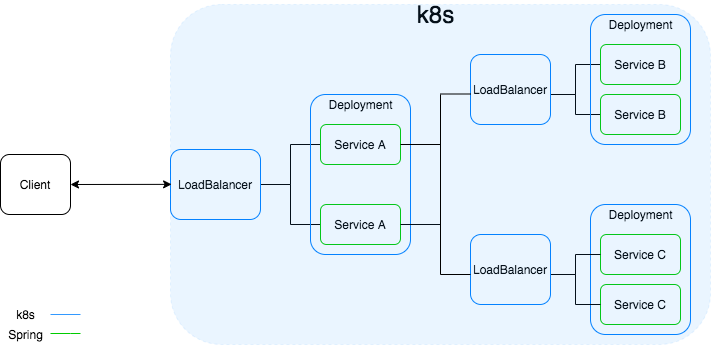

# Fault-tolerant Spring microservices on Kubernetes

## Shema

Services are spring RestController.
LoadBalancers are Kubernetes services.
Service A query the service B and C to give a response to the client.

## Resilience and Fault tolerance

### Circuit Breaker
Service A use Hystrix to implement the Circuit breaker design pattern. If 50% of the requests from A to B in a window of 10 seconds fails, a fallback method is used for 5 seconds. The same principle is applied for service C.

### Liveness Probes
The k8s deployment is configured to make a liveness probe every 2 minutes. If the service fails to respond it is automatically restarted. 

## Service Discovery and Load balancing
I rely on the service component of Kubernetes for service discovery and Round Robin load balancing. 
This can also be done with spring cloud Kubernetes but it is mandatory to give admin permissions to the pods to make spring able to query the Kubernetes API. 
This can be interesting to implement advanced load balancing strategies, allow inter namespace discovery or to access Kubernetes secrets and configMaps from the service.

## Hystrix Configuration
 - Allowed percentage of error: circuitBreaker.errorThresholdPercentage
 - Window: metrics.rollingStats.timeInMilliseconds
 - method Time-out: execution.isolation.thread.timeoutInMilliseconds
 - Ammount of time to wait before to retry: circuitBreaker.sleepWindowInMilliseconds